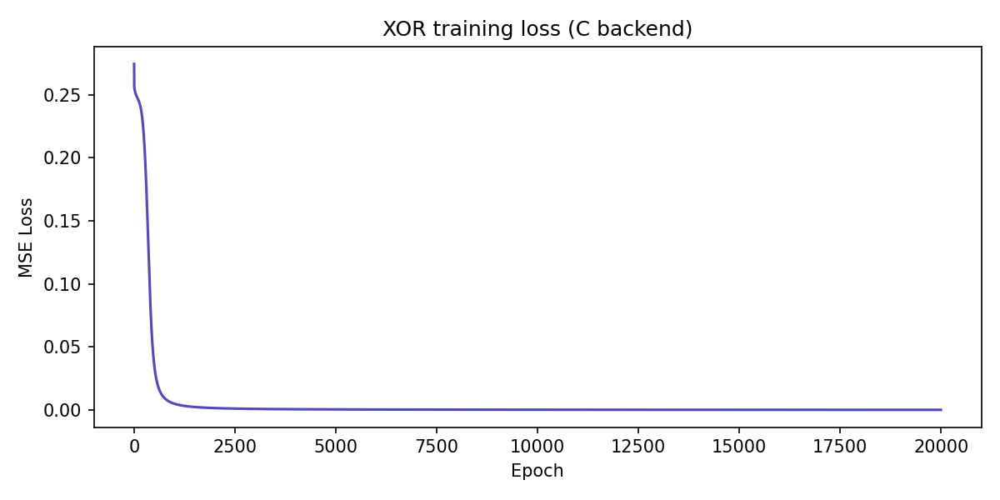

# Neural Network from Scratch — C + Python

A feedforward neural network built entirely from scratch in C, with a Python ctypes bridge.

No PyTorch. No TensorFlow. No NumPy for the math. Just C and raw memory.

## Architecture
- 2 inputs → 4 hidden neurons (sigmoid) → 1 output (sigmoid)
- Trained on XOR
- Xavier weight initialisation
- MSE loss + gradient descent backprop

## Files
- `nn_lib.c` — the neural network as a compiled shared library
- `nn.py` — Python driver that loads the DLL via ctypes
- `nn.c` — standalone C version (no Python bridge)

## Build & run

**Linux/Mac**
```bash
gcc -shared -fPIC -o nn_lib.so nn_lib.c -lm
python nn.py
```

**Windows (MinGW 64-bit)**
```bash
gcc -m64 -shared -o nn_lib.dll nn_lib.c -lm
python nn.py
```

## Loss Curve


## Results
```
Training for 20000 epochs...
  Epoch     0 | Loss: 0.2745
  Epoch  2000 | Loss: 0.0015
  Epoch  4000 | Loss: 0.0006
  Epoch  6000 | Loss: 0.0004
  Epoch  8000 | Loss: 0.0003
  Epoch 10000 | Loss: 0.0002
  Epoch 12000 | Loss: 0.0002
  Epoch 14000 | Loss: 0.0001
  Epoch 16000 | Loss: 0.0001
  Epoch 18000 | Loss: 0.0001

Final predictions:
  [0, 0] -> 0.010  (target: 0)
  [0, 1] -> 0.990  (target: 1)
  [1, 0] -> 0.991  (target: 1)
  [1, 1] -> 0.009  (target: 0)

```